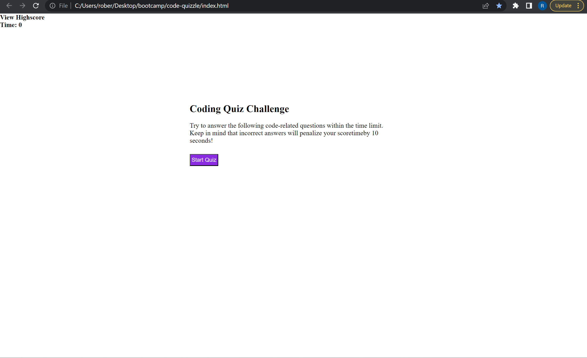
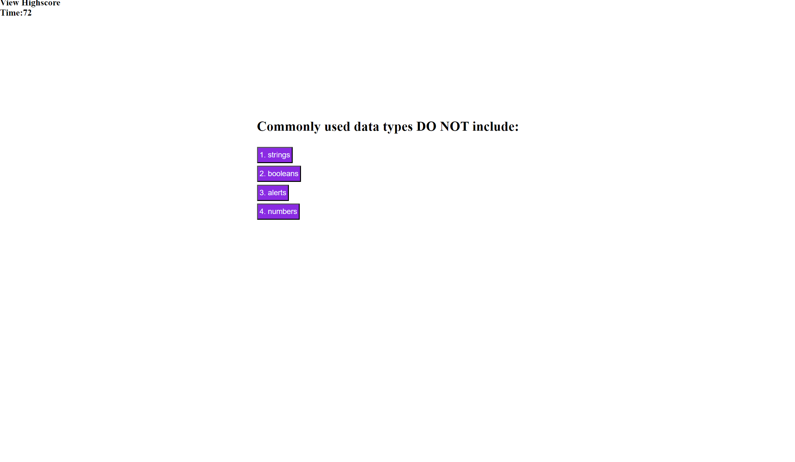
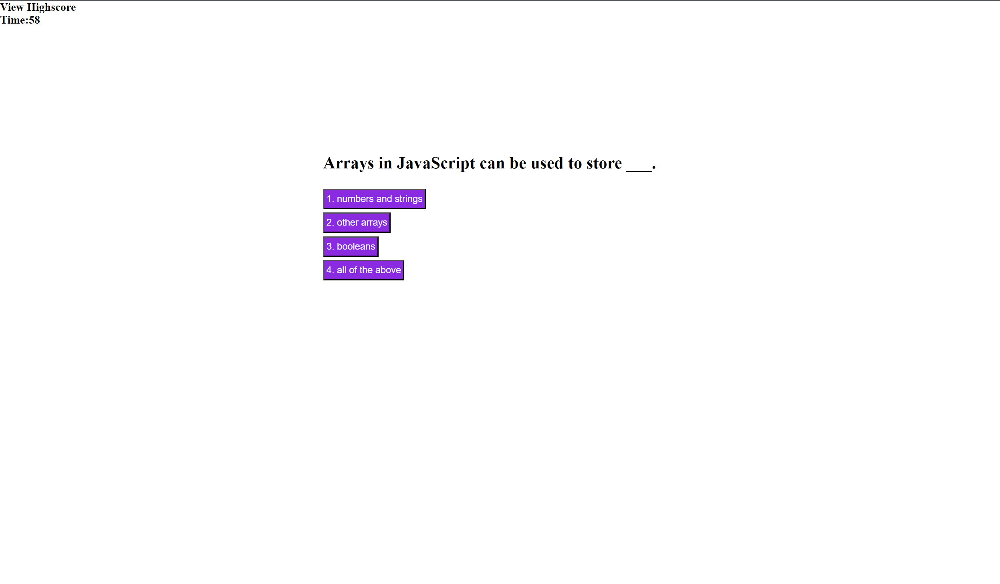

# code-quizzle

## Table of contents
​
- [Overview](#overview)
 - [The challenge](#the-challenge)
 - [Screenshot](#screenshot)
 - [Links](#links)
- [My process](#my-process)
 - [Built with](#built-with)
 - [What I learned](#what-i-learned)
 - [Continued development](#continued-development)
 - [Useful resources](#useful-resources)
- [Author](#author)
- [Acknowledgments](#acknowledgments)
​
## Overview
​
### The challenge
​
Users should be able to:
​
- create a timed quiz that used javascript in a script.js file, HTML in an index.js file and CSS in a style.js file
- introduce the script and style file to the index file at the correct spots to use them
- Use event listeners and document methods to interact with the HTML through the javascript
​
### Screenshot
​

​
​
### Links
​
- GitHub files: [Repo link](https://github.com/appleschaussaa/code-quizzle)
​
## My process
​
### Built with
​
- Semantic HTML5 markup
- CSS style
- Javascript
- APIs
​
### What I learned
​
I learned to appreciate some of the techniques we have learned since working with javascript in this way. Things have to be written out a lot more and hardly and shortcuts. I also realized that starting over from scratch would have been easier rather than adapting the code I had already used. I wanted to show that I was on the right path with what I had been working on when turned in and make that work.
​
### Continued development
​
Honestly I believe I have the correct code for determining the answer selected to determine where it is correct or incorrect but could not get it fully implimented. Also entering in initials and the score to the highscore page would be the next thing to fully work on. Finally some more CSS to make it a little cleaner would be nice

### Useful resources

- [onclick event resource](https://www.w3schools.com/jsref/event_onclick.asp) - Helped explain the click event and onClick usability
- [querySelector resource](https://developer.mozilla.org/en-US/docs/Web/API/Document/querySelectorAll) - Helped with using the querySelectors and distinguish the difference for the getElementById method.
- [reload() method resource](https://www.w3schools.com/jsref/met_loc_reload.asp) - This helped find a efficient way to restart the quiz without losing any information... theoretically

## Author

Robert Schauss
- GitHub - [appleschaussaa](https://github.com/appleschaussaa/code-quizzle)
​
## Acknowledgments
​
I would like to always thank our instructor and the TA's for helping out in our group activity breakout rooms and before and after class during office hours. Also having all the links in the bootcamp roadmap, which can be intimidating but usually helps out quite a bit. further help got me past some early on issues but still had a few stopping me from getting it to work 100%